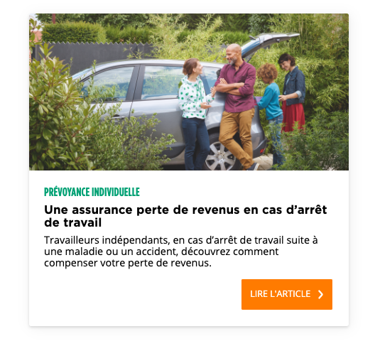

# Exercice 

En suivant la méthode de l'[atomic design](https://atomicdesign.bradfrost.com/chapter-2/), créer la molécule suivante :

Il y'a 4 atomes : 
  * `Title`
  * `Text`
  * `Button`
  * `Image`

La techno à utiliser doit se baser sur l'un des frameworks suivants au choix : `React.js`, `Vue.js`, `Svelte`.  
Concernant le CSS vous êtes libre d'utiliser ce que vous voulez (framework css, vanilla css, CSSinJS etc...)   

* Au clic sur le bouton : 
    * la couleur du premier titre change aléatoirement 
    * **un** compteur visible en dehors du composant et dans le bouton est incrémenté  
    * la valeur du compteur est persisté quand on recharge la page
* Le contenu est chargé depuis [l'adresse suivante](https://raw.githubusercontent.com/groupama-design/atomic-exercise/master/api.json) 
* Vous êtes libre sur le choix des fonts.

Versionner le projet sur un projet git et le mettre à disposition sur un hébergement type netlify, surge, vercel ou autre.